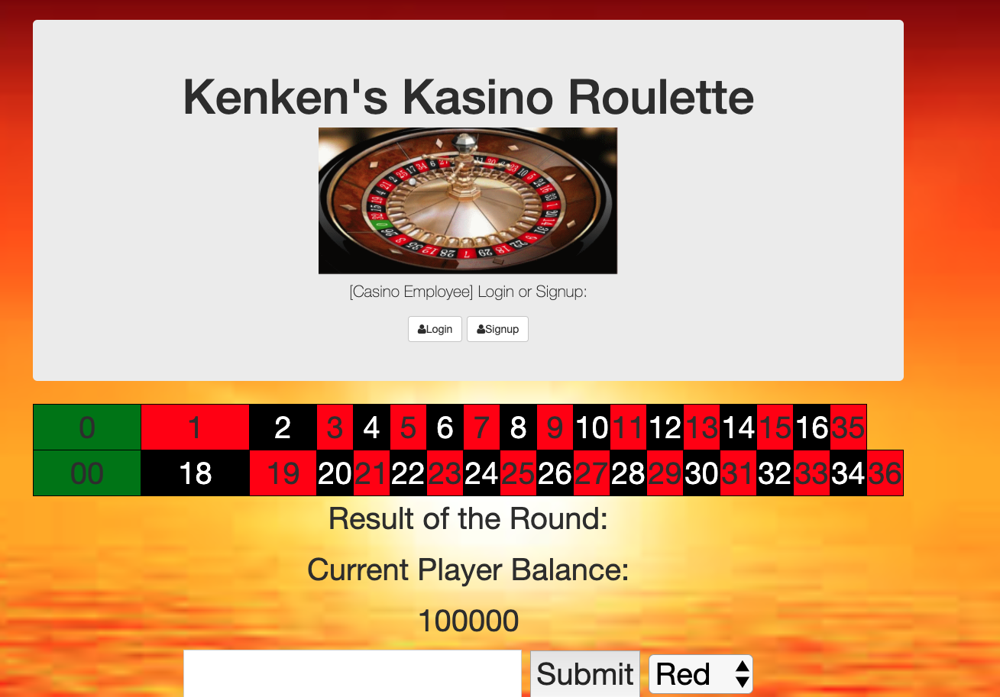

# Roulette FullStack Application

The Goal of this project was to build an APP that a casino customer
would use in order to place a bet on a roulette game.
Then, a casino employee would log in to see the current ledger of the
casino balance. The backend also lists each round and if the casino had
won money or not that round.

## How It's Made:
## Tech Used: HTML , CSS, JS, Node, MongoDB, Express
The project had a layout built using HTML/CSS with JS and Node/MongoDB on the backend.
Bets & Results stored on a Mongo database and the retrieval uses Node.js

## Lessons Learned
This project allowed me to test the ability of entering form info into a
database and retrieving it to display on the DOM.

## Installation
1. Clone repo
2. run `npm install`

## Usage

1. run `node server.js`
2. Navigate to `localhost:3030`

## Logging into the Sample
1. username: casino
2. password: casino
